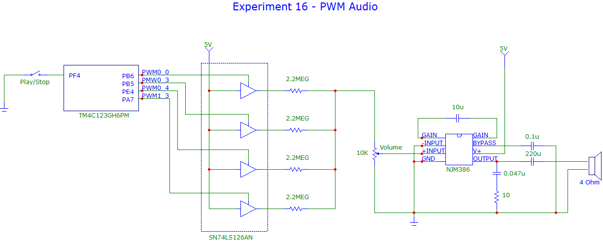

# Experiment16-PWM-Audio

## Overview
This experiment uses multiple PWM channels to produce audio signals and play tunes from MIDI files. A MIDI file exporter program was written in Visual Studio using the midifile parsing library (http://midifile.sapp.org/). The exporter generates a .c file that is compiled into the Keil project for the Tiva C. Up to four MIDI tracks are exported. 

Each MIDI track is controlled at run time by a FreeRTOS task that schedules and plays the track's note events. Playing a note involves modulating one of the Tiva's PWM channels to a frequency equal to the note's audio frequency. 

The PWM outputs are combined and amplified by a circuit that consists of tri-state buffers (stage 1) and an NJM386 audio amplifier (stage 2). Each PWM output controls the enable pin of a tri-state buffer, such that when the PWM pulse is HIGH, the buffer's output voltage is added to the input signal of stage 2; and when the PWM pulse is LOW, the buffer enters a high impedance state and is effectively removed from the audio input signal.

 
[Watch the video](https://youtu.be/MY4hRxabXYo)

  