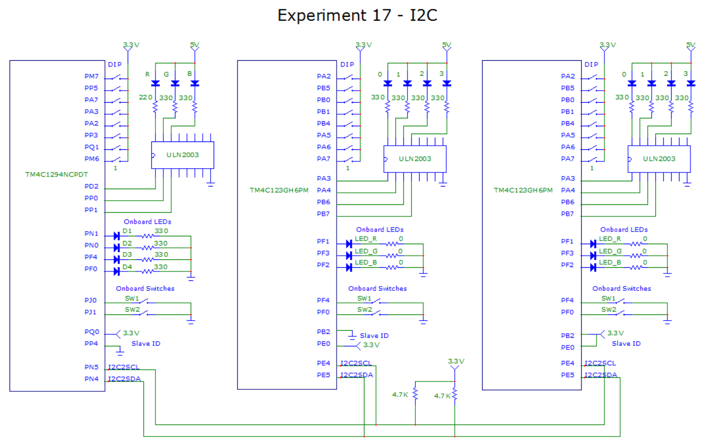

# Experiment17-I2C

## Overview
This experiment connects three Tiva C boards together to form an I2C bus.  One of the boards is an EK-TM4C1294XL and the other two are EK-TM4C123GXL boards.  The purpose of the experiment was to get familiar with I2C and I2C programming on the Tivas, and also to learn about the differences between the TM4C1294 and TM4C123.  

Each board is configured to be both a master and slave on the bus.  They are each connected to eight switches, one tri-color LED (or three separate color LEDs for the TM4C1294), and four green LEDs to display a number pattern. Three different commands can be sent from any one board to another.  The WRITE command sends the switch settings from a master board to a slave board, and the slave will display the settings on its LEDs.  The READ command causes a master board to read the switch settings from a slave board and then display them on its own LEDs.  The BLINKY command can be send from a master board to a slave, causing the slave board to enter into blinking a pattern.  The WRITE and BLINKY commands can also be sent to all boards on the bus in one transaction that uses repeated starts.

The Keil project has separate targets set up for the TM4C1294 and TM4C123, and there startup folders for each board that contain a different startup file and main function.  Building the project for one target disables the startup files for the other.  In addition, the HAL modules use conditional compilation when there are implementation difference between the two processors.  Flags in the HAL_Config.h file will turn on/off these conditional areas.
 
  