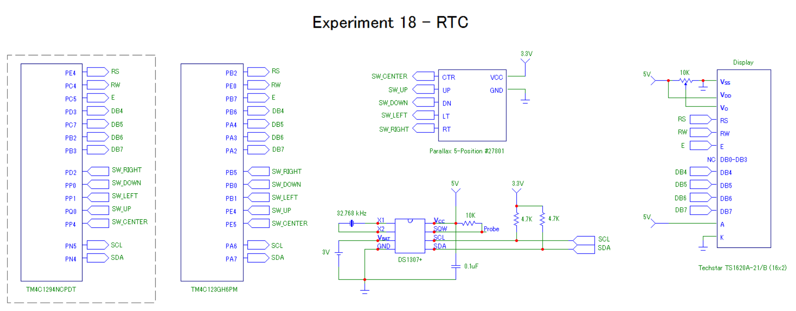

# Experiment18-RTC (Real-time Clock)

## Overview
This experiment uses a DS1307 real-time clock IC to manage a calendar and clock.  The running date and time are displayed on an LCD,  and a five-position switch is used to set them.  The Tiva C board communicates with the chip using a 100kbps I2C connection.  A 3V coin cell battery keeps the clock running when main power is removed.   A driver was written with functions to initialize and enable the clock, and to read and write data from it.   This experiment runs on both the TM4C123G and TM4C1294. 

  
