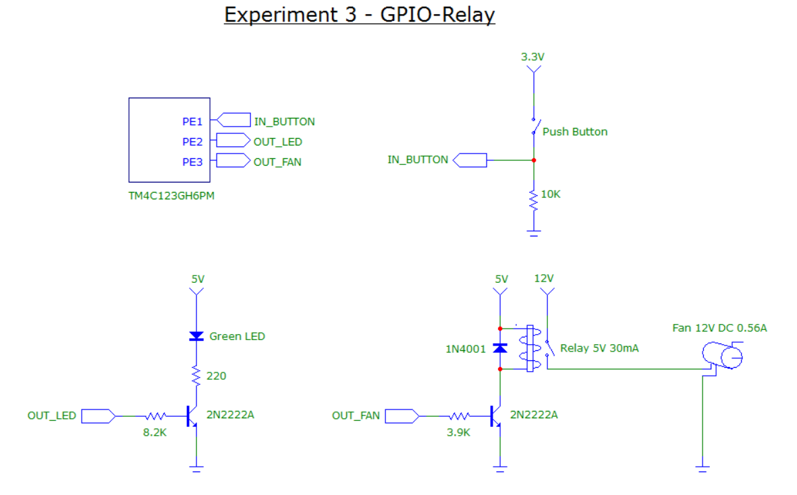

# Experiment3-GPIO-Relay

## Overview
This experiment tests the GPIO on the EV-TM4C123GLX board.  The purpose of it is to press a button that turns on an LED and accuate a relay that turns on a 12V fan motor.  The fan's power supply is different from the Tiva board's.

 
[Watch the video](https://youtu.be/kNR2bn99Wfo)

  