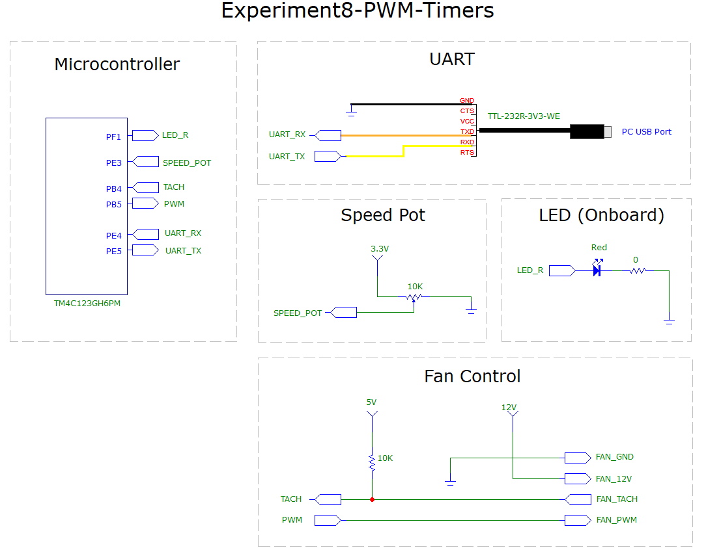

# Experiment8-PWM-Timers

## Overview
This experiment is the implementation of a fan speed controller that tests out the PWM and timer block features of the Tiva board.  It controls a 12V fan that has a PWM input and tachometer output.  To vary the fan speed, a potentiometer was connected to one of the ADC inputs on the board, and the ADC sample converted to a duty cycle.  Turning the pot in one direction narrows the pulse and slows down the fan, and in the other direction it widens the pulse and speeds up the fan.

The fan's tachometer output is a square wave.  Every two pulses represent one revolution of the fan.  To count the pulses, an input edge counter (timer) was set up on the board to count the rising edges, and another timer (count-down) was set up to raise an interrupt every second.  Inside the ISR, the tach pulse count is read and stored in a shared variable, and then both timers are reset to do this again every second.  The main program reads the stored pulse count, converts it to RPM, and then writes the value to the UART where it is displayed on the PC.

 
[Watch the video](https://youtu.be/nJTgNQMfvj8)

  

Pin and wiring specifications for PWM controlled fans can be found here: 
https://web.archive.org/web/20110726062453/http://www.formfactors.org/developer/specs/4_Wire_PWM_Spec.pdf

Additional resources for computer fan control can be found on WikiPedia: 
https://en.wikipedia.org/wiki/Computer_fan_control