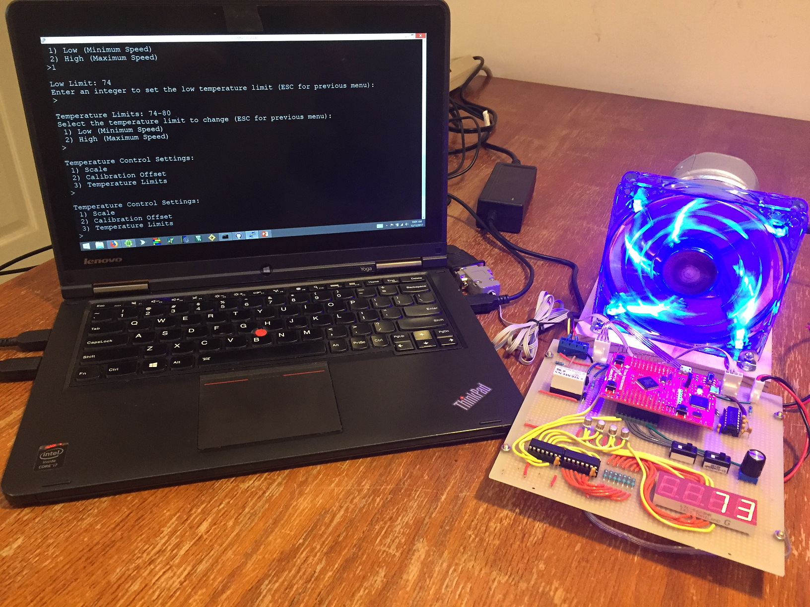
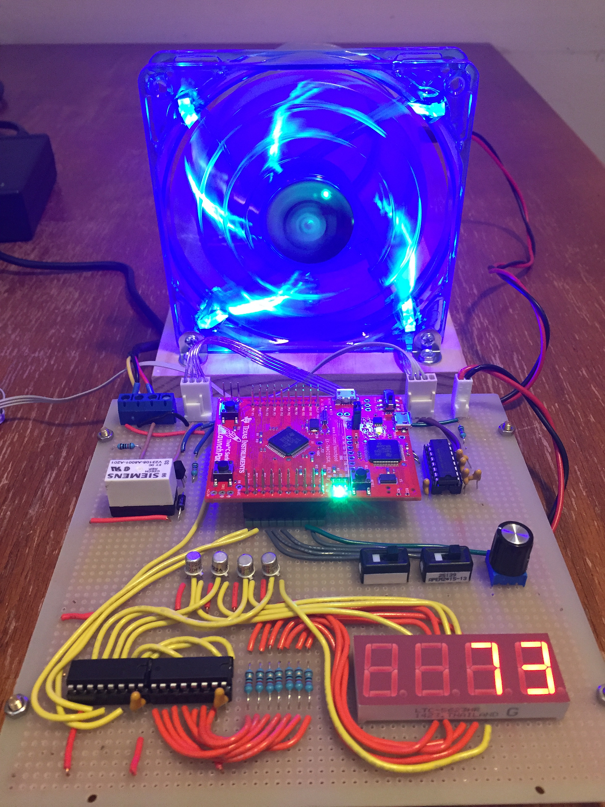
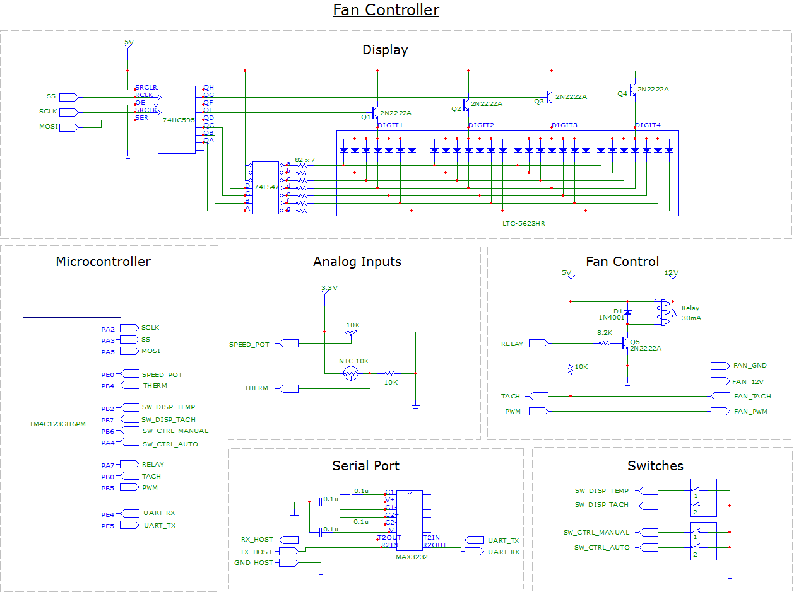

# Fan Controller

## Overview
The project is a fan controller system.  It features PWM speed control, a numeric display, and a serial console to the PC. The PWM speed control interfaces with standard 4-wire PWM fans.  It supports thermal and manual control modes and RPM measurement of the fan's tachometer signal.  The display shows the fan speed (0-100), RPM, or current temperature, and the serial console interface provides a menu-driven UI for configuring the temperature control settings.

Hardware features used on the Tiva TM4C123 board include GPIO, ADC, PWM, SPI, Timers, UART, PLL, SysTick, and Flash storage.   The firmware was written in C using Keil Microvision and uses direct register access to control the hardware.

Users can configure the system for linear thermal control by setting lower and upper temperature limits.  When the environment temperature reaches the lower limit, the fan will turn on at the slowest speed and increase linearly up to the maximum speed, proportional to the higher temperature limit.  Above the high limit the fan will run at full speed.   Thermostatic control can be configured by setting the low and high temperature limits the same, which turns the fan on at full speed when the temperature is the same or above the limit.

This project evolved from the 12 prior experiments and contains some or all of the features from each.

{
  width: 612px;
  border: none;
  background: none;
}

 
[Watch the video](https://youtu.be/YEEtr2Ipl0c)

  