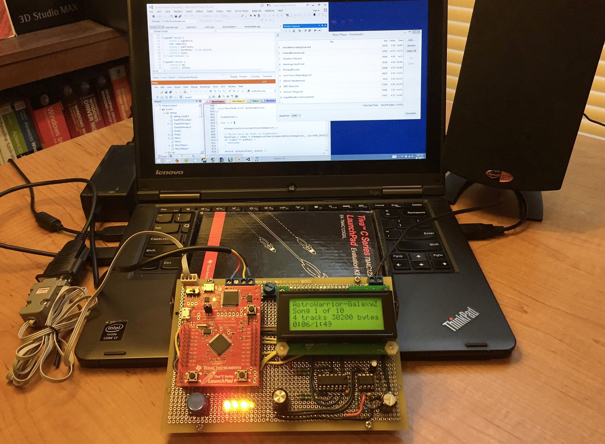
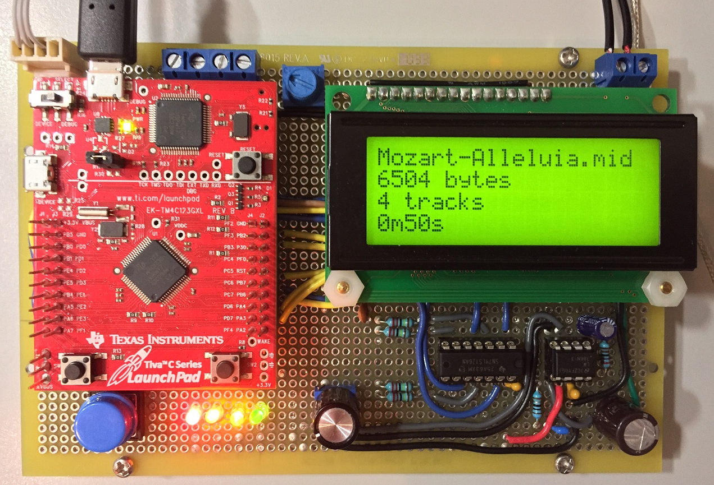
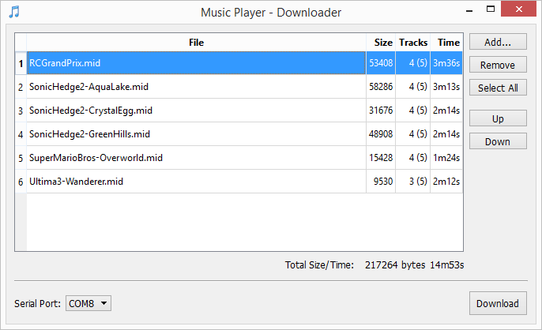
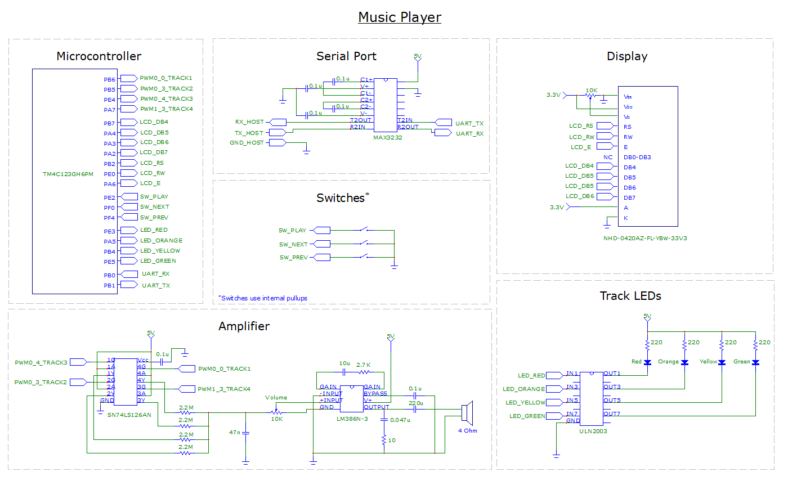
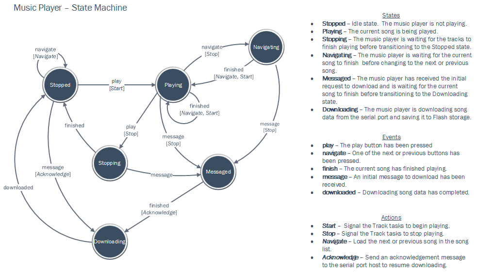
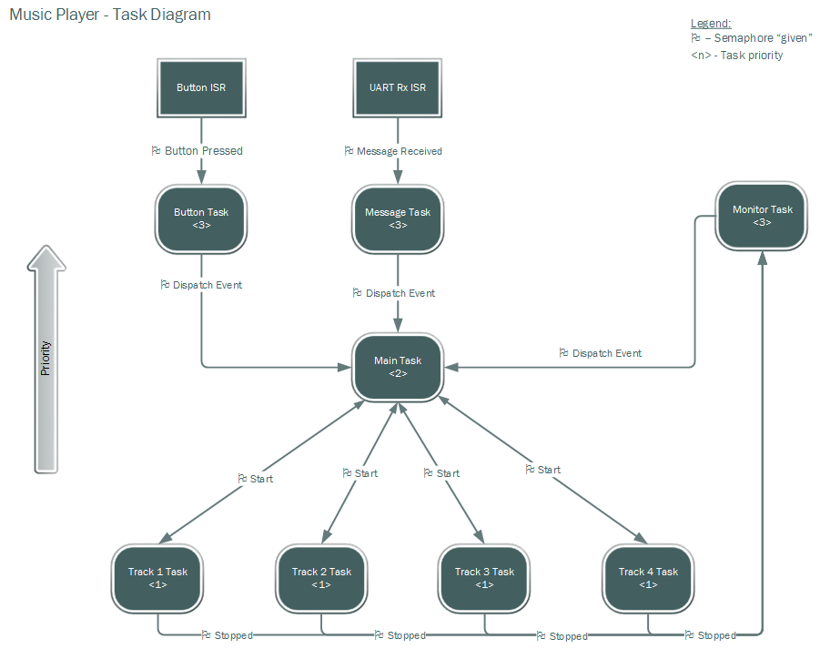
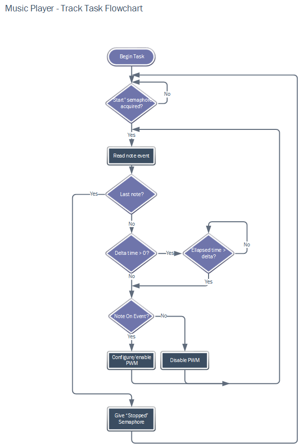

# Music Player

## Overview
This project uses the Tiva C EK-TM4C123GXL board to build a device that plays the music from early video games.  The music data comes from MIDI files, and is converted to an optimized format that is downloaded to the Tiva's Flash memory from the PC's serial port.  Up to 224Kib of song data can be downloaded (about 8 to 12 songs).  The firmware uses FreeRTOS, and is an example of a soft real-time system.

The buttons on the Tiva are used to cycle to the next and previous songs in the song list, and the blue button on the board toggles between Play and Stop.  An LCD displays information about the current song, such as its name, song index, track count, size, and length.  Each second, a time marker is incremented as the song plays.  

To produce the musical sounds, the Tiva's PWM channels are used to generate square waves at the audio frequencies of the musical notes.  The square waves are summed together and amplified by an LM386.  The player board supports up to four monophonic, instrument tracks, one of which can be used as a percussion track.  The percussion track generates a sound using white noise that simulates a closed hi-hat.

The firmware was designed as a state machine with a total of six states, five events, and four actions.  Zero or more actions are invoked when an event causes a transition from one state to another.   The main program is implemented by two interrupt service routines (ISRs) and eight FreeRTOS tasks.  The tasks can be in a running or blocked state at any given time.  The tasks and ISRs synchronize by giving/taking binary semaphores.   

This project builds on the work from Experiments 14-16, as well as Experiments 6 & 13.

 
[Watch the video](https://youtu.be/1OvchymIkCs)

### Images

#### Music Player

#### Downloader Screen

#### Circuit Diagram

#### State Diagram

#### Task Diagram

#### Track Task Flowchart

